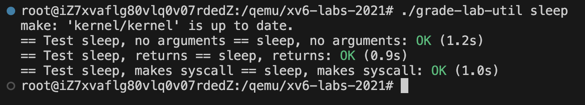

# 完成记录

使用 grade-lab-util 文件检测

## sleep



## pingpong


## primes


## find


## xargs


# 逐题解析

## sleep

目标：让进程休眠指定的 tick 数量

当前在 kernel 中已经有 sleep 函数，需要的是在 user 部分调用

同时需要在 makefile 上增加编译这个 sleep.c 文件

### 主要代码

```c
int main(int argc, char *argv[]) {
  if(argc != 2){
    printf("Usage: sleep <ticks>\n");
    exit(0);
  }
  int ticks = atoi(argv[1]);
  if(ticks < 0){
    printf("sleep: ticks must be non-negative\n");
    exit(0);
  }
  sleep(ticks);
  exit(0);
}
```

代码说明：

通过检查参数的长度判断是否合理

如果 sleep ticks 是负数同理

## pingpong

目标：父子进程通过管道互发一个字节，实现“乒乓”通信。

当前已经提供了管道 pipe，阻塞的 read 和 write ，以及创建子进程的 fork 函数。

使用这四个函数构建一个管道互发

### 主要代码

```c
int main() {
  int p1[2], p2[2];
  pipe(p1); pipe(p2);
  int pid = fork();
  if(pid == 0){
    // child
    char buf;
    close(p1[1]); close(p2[0]);
    read(p1[0], &buf, 1);
    printf("%d: received ping\n", getpid());
    write(p2[1], &buf, 1);
    close(p1[0]); close(p2[1]);
    exit(0);
  } else {
    // parent
    char buf = 'A';
    close(p1[0]); close(p2[1]);
    write(p1[1], &buf, 1);
    read(p2[0], &buf, 1);
    printf("%d: received pong\n", getpid());
    close(p1[1]); close(p2[0]);
    wait(0);
    exit(0);
  }
}
```

- **p1 管道** ：子进程通过 `p1[0]` 读取父进程发送的数据。
- **p2 管道** ：子进程通过 `p2[1]` 发送数据回父进程。

```
父进程                  子进程
  |                       |
  | 写入 p1[1]            |
  | --------------------> |
  |                       |
  | <-------------------- |
  | 读取 p2[0]            |
  |                       |
```

## primes

目标：使用递归实现一个素数筛

需要在不同子进程之间传递消息，使用管道来传递

### 主要代码

```c
#include "kernel/types.h"
#include "user/user.h"

// 素数筛法的递归函数
// pfd[2]：当前进程的管道描述符（pfd[0]为读端口，pfd[1]为写端口）
void sieve(int pfd[2]) {
    // 关闭当前进程的写端口，因为只从父进程接收数据
    close(pfd[1]);

    int prime;
    // 从管道读取一个整数（会阻塞直到有数据到达）
    // 如果读取到的数据长度不等于int大小，说明管道已关闭，结束进程
    if (read(pfd[0], &prime, sizeof(prime)) != sizeof(prime)) {
        close(pfd[0]);
        exit(0);
    }

    // 当前读取的值是素数，输出结果
    printf("prime %d\n", prime);

    // 创建新的管道用于传递非prime倍数的数给下一层筛子
    int next, cfd[2];
    pipe(cfd);

    // 创建子进程负责处理下一层筛法
    int pid = fork();
    if (pid == 0) {  // 子进程逻辑
        close(pfd[0]);
        sieve(cfd);     // 递归调用筛法函数
        exit(0);
    } else {  // 父进程逻辑（当前筛子层）
        while (read(pfd[0], &next, sizeof(next)) == sizeof(next)) {
            // 如果不是当前素数的倍数，传递给下一层筛子
            if (next % prime != 0)
                write(cfd[1], &next, sizeof(next));  // 写入下一层管道
        }

        // 所有数据处理完毕，清理资源
        close(pfd[0]);
        close(cfd[1]);
        wait(0);
        exit(0);
    }
}

int main() {
    int pfd[2];      // 管道描述符数组
    pipe(pfd);

    int pid = fork();
    if (pid == 0) {    // 子进程负责启动筛法
        sieve(pfd);
        exit(0);
    } else {         // 父进程负责注入初始数据
        close(pfd[0]);  // 关闭读端口，只负责写入

        // 向管道注入初始数据：2到35的整数序列
        for (int i = 2; i <= 35; i++)
            write(pfd[1], &i, sizeof(i));

        close(pfd[1]);  // 数据写入完成，关闭写端口
        wait(0);        // 等待子进程处理完成
        exit(0);
    }
}
```

代码解析：

最上层的父进程不计算素数，只负责将初始数据注入管道，让子进程依次读取


筛出的数直接输出，不需要单独记录

##  find

目标：递归查找目录树下所有指定名字的文件。

注意是查找文件，也就是说，遇到目录就递归，遇到文件就判断

注意，需要跳过当前目录“.”和上级目录“..”

### 主要代码

```c
void find(char *path, char *target) {
  int fd;                 // 文件描述符，用于打开目录
  struct stat st;         // 用于保存文件/目录的状态信息
  struct dirent de;       // 目录条目结构体，包含文件名和 inode 编号
  char buf[512];          // 缓冲区，用于构造当前遍历到的文件路径
  char *p;                // 指针，指向 buf 中路径拼接的位置

  // 打开指定路径对应的目录文件
  if((fd = open(path, 0)) < 0)
    return;

  // 获取该路径对应文件的状态信息（是否为目录）
  if(fstat(fd, &st) < 0){
    close(fd);
    return;
  }

  // 如果不是目录，则不继续处理
  if(st.type != T_DIR){
    close(fd);
    return;
  }

  // 将原始路径复制到缓冲区中
  strcpy(buf, path);

  // p 指向路径字符串末尾，准备追加文件名
  p = buf + strlen(buf);

  // 如果路径末尾没有斜杠 '/'，则添加一个
  if(*(p-1) != '/') *p++ = '/';

  // 循环读取目录下的每一个条目
  while(read(fd, &de, sizeof(de)) == sizeof(de)){
    // 跳过无效条目（inum 为 0 表示未使用）
    if(de.inum == 0)
      continue;

    // 跳过 "." 和 ".." 这两个特殊目录项
    if(strcmp(de.name, ".") == 0 || strcmp(de.name, "..") == 0)
      continue;

    // 将当前目录项的文件名拷贝到路径缓冲区中
    memmove(p, de.name, DIRSIZ);
    p[DIRSIZ] = 0;

    // 清理路径字符串中多余的空字符 '\0'（因为 DIRSIZ 可能比实际文件名长）
    for(int i = strlen(buf)-1; i > 0 && buf[i] == '\0'; i--)
      buf[i] = 0;

    // 获取当前文件的状态信息
    if(stat(buf, &st) < 0)
      continue;

    // 如果是目录，则递归调用 find 查找该子目录
    if(st.type == T_DIR)
      find(buf, target);

    // 如果文件名匹配目标文件名，输出完整路径
    if(strcmp(de.name, target) == 0)
      printf("%s\n", buf);
  }

  close(fd);
}

int main(int argc, char *argv[]) {
  // 检查命令行参数数量是否正确（必须提供路径和文件名）
  if(argc != 3){
    fprintf(2, "Usage: find <path> <filename>\n");
    exit(1);
  }

  // 调用 find 函数开始查找
  find(argv[1], argv[2]);

  exit(0);
}
```

在递归的过程需要记住递归的路径，并添加到绝对路径中传入下一层递归

## xagrs

目标：从标准输入读取每一行，作为参数追加到命令后并执行。

首先用到了管道符号，即把前面的内容（或返回值）作为后面的输入

xargs 则是转换成命令行输入而非标准化输入

还需要注意，实验要求中对换行符的要求

```bash
$ echo "1\n2" | xargs -n 1 echo line
line 1
line 2
$
```

即使用换行符来表示不同的命令批次

以及，实验要求，每行的执行都应该是一个子进程，然后最后的父进程需要等待所有子进程运行。

### 主要代码

```c
int main(int argc, char *argv[]) {
  char buf[512];                     // 缓冲区，用于存储用户输入的一行命令
  char *args[MAXARG];                // 参数数组，用于传递给 exec 的命令参数
  int i;

  // 将命令行参数（除了程序名本身）复制到 args 数组中
  for(i = 1; i < argc && i < MAXARG - 1; i++)
    args[i - 1] = argv[i];

  int n = i - 1;                     // n 表示当前已有的参数数量
  int idx = 0;                       // 用于追踪 buf 中写入的位置

  char ch;
  // 从标准输入逐字符读取内容，直到遇到 EOF（文件结束）
  while(read(0, &ch, 1) == 1){
    if(ch == '\n'){                  // 遇到换行符表示一行命令结束
      buf[idx] = 0;                  // 在字符串末尾添加 null 终止符
      if(idx > 0){                   // 如果这一行不是空行

        int m = 0, j = 0;
        // 解析 buf 中的命令参数，按空格分割
        while(j < idx){
          // 跳过前面的空格
          while(buf[j] == ' ' && j < idx)
            j++;

          if(j >= idx) break;        // 如果已经处理完所有字符，跳出循环

          args[n + m] = &buf[j];     // 记录当前参数的起始地址

          // 找到下一个空格或字符串结尾，插入 null 终止符
          while(buf[j] != ' ' && buf[j] != 0 && j < idx) j++;

          buf[j] = 0;                // 将空格替换为字符串结束符
          j++;
          m++;
        }

        args[n + m] = 0;

        // 创建一个子进程来执行命令
        if(fork() == 0){
          exec(args[0], args);
          exit(1);                   // 如果 exec 失败，退出子进程
        } else {
          // 父进程等待子进程执行完成
          wait(0);
        }
      }
      idx = 0;
    } else {
      // 当前字符不是换行符，继续写入缓冲区
      if(idx < sizeof(buf) - 1)
        buf[idx++] = ch;
    }
  }

  exit(0);
}
```

代码解析

需要做的就是把命令按照回车分割读入，然后执行

需要注意，在实现的时候，管道符号前面的内容的标准化输入可以用过文件描述符 0 来读取到

下面的原文内容：

>  By convention, a process reads from file descriptor 0 (standard input), writes output to file descriptor 1 (standard output), and writes error messages to file descriptor 2 (standard error). 
