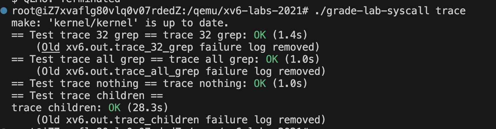
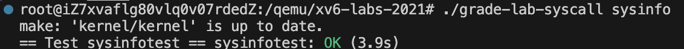

# 完成记录

使用 grade-lab-syscall 文件检测

## trace



## sysinfo




# 逐题解析

## trace

目标：跟踪某个命令调用了指定的系统调用（使用 mask 和系统调用的指定编号记录），并且需要记录其子进程的调用

在实验提示中写明了，需要在多个文件中添加内容，实现增加一个系统调用

同时，为了让子进程也能知道自己需要监控哪个系统调用，此处采用在进程结构体中增加一个 tracemask 的值的方式，并且注意需要同步修改 fork 实现，让 fork 的时候从父进程正确读取 tracemask

最后，在 syscall 的时候判断，tracemask 是否有效（默认全为 0，不是 0 则表示有效，需要监控），有效的时候就在 syscall 的同时输入调用的细节。

### 主要代码

#### 新增系统调用号

在 `kernel/syscall.h` 中添加：

```c
#define SYS_trace 22
```

#### 进程结构体

在 `kernel/proc.h` 的 `struct proc` 中添加：

```c
int tracemask;
```

#### 系统调用实现

在 `kernel/sysproc.c` 中实现：

```c
uint64 sys_trace(void) {
  int mask;
  if(argint(0, &mask) < 0)
    return -1;
  myproc()->tracemask = mask;
  return 0;
}
```

#### fork 继承的时候同步tracemask

在 `kernel/proc.c` 的 fork 实现中添加：

```c
np->tracemask = p->tracemask;
```

#### syscall 处跟踪输出

在 `kernel/syscall.c` 的 syscall() 函数中增加：

```c
if(p->tracemask & (1 << num)){
  printf("%d: syscall %s -> %d\n", p->pid, syscall_names[num], ret);
}
```


## sysinfo

目标：sysinfo 系统调用用于获取当前系统的空闲内存字节数和活跃进程数。用户传入 struct sysinfo 指针，内核填充数据。

同样，和trace 一样修改必要的系统调用信息。并且，用户态需要同时声明 sysinfo 命令，并且在用户态说明这个 sysinfo 指针的结构（不然不知道数据结果，用户没法读取了）

在实现层面，需要做三件事：统计空闲的内存字节数、统计活跃的进程数、将信息读取和写入

前两个实现在提示中写到

> - To collect the amount of free memory, add a function to `kernel/kalloc.c`
> - To collect the number of processes, add a function to `kernel/proc.c`

可以参考这两个文件

分析可以知道，kalloc 中管理了一个空闲内存的链表，所以链表的长度就是空闲内存数量

在 proc 中，有类似进程池的形式，然后遍历这个池中，state **不为** UNUSED 的进程并计数

### 主要代码

#### 系统调用号

在 `kernel/syscall.h`：

```c
#define SYS_sysinfo 23
```

#### 统计空闲内存

在 `kernel/kalloc.c`：

```c
uint64 count_freemem(void) {
  struct run *r;
  uint64 n = 0;
  acquire(&kmem.lock);
  r = kmem.freelist;
  while(r){
    n += PGSIZE;
    r = r->next;
  }
  release(&kmem.lock);
  return n;
}
```

#### 统计活跃进程数

在 `kernel/proc.c`：

```c
uint64 count_proc(void) {
  struct proc *p;
  uint64 n = 0;
  for(p = proc; p < &proc[NPROC]; p++){
    if(p->state != UNUSED)
      n++;
  }
  return n;
}
```

#### 系统调用实现

在 `kernel/sysproc.c`：

```c
uint64 sys_sysinfo(void) {
  uint64 addr;
  if(argaddr(0, &addr) < 0)
    return -1;
  struct sysinfo info;
  info.freemem = count_freemem();
  info.nproc = count_proc();
  if(copyout(myproc()->pagetable, addr, (char*)&info, sizeof(info)) < 0)
    return -1;
  return 0;
}
```

#### 注册系统调用

在 `kernel/syscall.c`：

```c
extern uint64 sys_sysinfo(void);
[SYS_sysinfo] sys_sysinfo,
```

代码解析：

接受和写入结构体可以参考系统的其他代码部分
